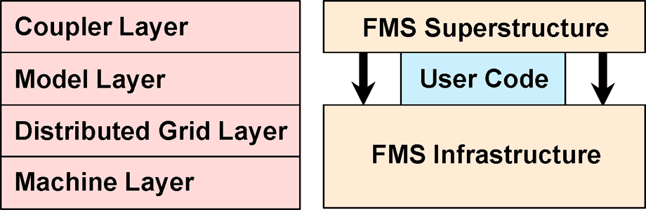

\page rm General Project Information
# Modeling Framework: Flexible Modeling System (FMS)

Today’s climate models simulate highly complex systems. In response to
increasingly complex models, the climate community has developed tools and
methodologies to facilitate the modeling process and many common tasks (e.g.,
calendar management, grid generation, I/O). Such frameworks come with a number
of advantages, including decreased model development time and increased
compatibility of interfaces.

The Flexible Modeling System (FMS) is a software environment that supports the
efficient development, construction, execution, and scientific interpretation of
atmospheric, oceanic, and climate system models. This framework allows
algorithms to be expressed on a variety of high-end computing architectures
using common and easy-to-use expressions of the underlying platforms, spanning
distributed and shared memory, as well as high-performance architectures.
Scientific groups at GFDL can develop new physics and new algorithms
concurrently, and coordinate periodically through this framework.

Modeling frameworks for the construction of coupled models, made from
independent model components, are now prevalent across this field. FMS was one
of the first frameworks to be developed — since the advent of the Cray T3E in
1998 — and is still in use and under development today, using new architectures
and new algorithms.

## What is FMS

The Flexible Modeling System (FMS) is a software framework for supporting the
efficient development, construction, execution, and scientific interpretation of
atmospheric, oceanic, and climate system models.  FMS consists of the
following:

1. A software infrastructure for constructing and running atmospheric, oceanic,
and climate system models. This infrastructure includes software to handle
parallelization, input and output, data exchange between various model grids,
orchestration of the time stepping, makefiles, and simple sample run scripts.
This infrastructure should largely insulate FMS users from machine-specific
details.
2. A standardization of the interfaces between various component models
including software for standardizing, coordinating, and improving diagnostic
calculations of FMS-based models, and input data preparation for such models.
Common preprocessing and post-processing software are included to the extent
that the needed functionality cannot be adequately provided by available
third-party software.
3. Contributed component models that are subjected to a rigorous software
quality review and improvement process. The development and initial testing of
these component models is largely a scientific question, and would not fall
under FMS. The quality review and improvement process includes consideration of
(A) compliance with FMS interface and documentation standards to ensure
portability and inter-operability, (B) understandability (clarity and
consistency of documentation, comments, interfaces, and code), and (C) general
computational efficiency without algorithmic changes.
4. A standardized technique for version control and dissemination of the
software and documentation.

FMS does not include the determination of model configurations, parameter
settings, or the choice amongst various options. These decisions require
scientific research. Similarly, the development of new component models is a
scientific concern that is outside of the direct purview of FMS. Nonetheless,
infrastructural changes to enable such developments are within the scope of FMS.
The collaborative software review process of contributed models is therefore an
essential facet of FMS.

## Documentation

Source code documentation for the FMS code base is available at http://noaa-gfdl.github.io/FMS.
The documentation is generated by doxygen and updated upon releases, and a copy of the site
can be obtained through the `gh-pages` branch or generated manually with
`./configure --enable-docs && make -C docs`. For more information on documentating the code
with doxygen please see the
[documentation style guide](http://noaa-gfdl.github.io/FMS/md_docs_doxygenGuide.html).

# Disclaimer

The United States Department of Commerce (DOC) GitHub project code is provided
on an 'as is' basis and the user assumes responsibility for its use. DOC has
relinquished control of the information and no longer has responsibility to
protect the integrity, confidentiality, or availability of the information. Any
claims against the Department of Commerce stemming from the use of its GitHub
project will be governed by all applicable Federal law. Any reference to
specific commercial products, processes, or services by service mark,
trademark, manufacturer, or otherwise, does not constitute or imply their
endorsement, recommendation or favoring by the Department of Commerce. The
Department of Commerce seal and logo, or the seal and logo of a DOC bureau,
shall not be used in any manner to imply endorsement of any commercial product
or activity by DOC or the United States Government.

This project code is made available through GitHub but is managed by NOAA-GFDL
at https://gitlab.gfdl.noaa.gov.
